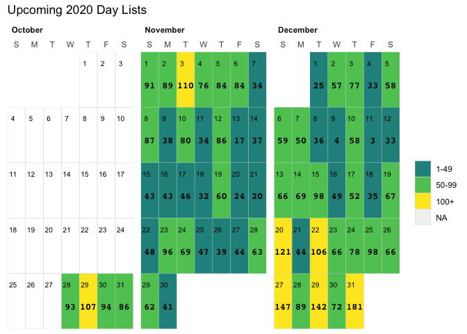

Exploring Auklet
================
Sarah Toner
8/10/2020

## Package Installs

``` r
# install packages if you don't have them; auklet and ggcal from github below
# install.packages("devtools")
#devtools::install_github("mstrimas/auklet")
#devtools::install_github("jayjacobs/ggcal")
library(auklet)
library(dplyr)
library(tidyverse)
library(ggcal)
library(stringi)
library(readxl)
```

## Loading and formatting personal eBird data

You can download your data from My eBird here:
<https://ebird.org/downloadMyData> (may take a few minutes for request
to process and show up in your inbox). Each row represents a submission
(one single species and its relevant data on a checklist). There’s a
wealth of data to play with including date/time, location (categorical
and lat/lon), media catalog numbers, and of course the bird species &
counts.

`auklet` has a way of loading in data; however, as of 8/2020, it wasn’t
working with the current My eBird export. I think some of the headers
and date/time formats have changed. I developed the workaround below.

If you don’t have it, you’ll need to download the Excel version of the
2019 eBird Taxonomy, available here:
<https://www.birds.cornell.edu/clementschecklist/download/>

First, these two attached scripts format the 2019 taxonomy properly for
use and fix some small broken pieces in auklet functions.

``` r
setwd("~/Documents/Auklet-Exp") # set your working directory

source("ebtaxonomy.R") #do taxonomy first so other functions can call on it
source("auklet_fxns.R") 
```

Auklet\_fxns contains two main functions:

  - Function `eb_sightings2` fixes `auklet::eb_sightings` to allow the
    use of 2019 taxonomy and 2020 eBird exports, changes the date/time
    format when reading in the file, and removes the header check that
    seemed to be broken
  - Function `eb_lifelist_day2` fixes `auklet::eb_lifelist` to allow the
    use of 2019 taxonomy

Note that `eb_sightings2` no longer explicitly defines date format.
Check the outputs to make sure the dates came through properly.

``` r
ebird_data <-  eb_sightings2("MyEBirdData_10-9-20.csv") #may throw a warning about parsing issues from NAs in effort; not a big problem

day_lists <- eb_lifelist_day2(ebird_data)
```

This will create a summary of your day lists. You can create a stunning
plot over the course of the year with the `plot` function.

``` r
plot(day_lists)
```

    ## Warning: Removed 17 rows containing missing values (geom_bar).

<!-- -->

In order to get the data out of the ebird sightings format to mess
around with it more, use `summary`

``` r
counts <- summary(day_lists)
```

### Calendar Visualizations

We’ll start with a basic calendar plot over the course of a year:

``` r
#convert numbers to dates
#
counts$date <- strptime(paste(counts$month,counts$day),"%m %d")

# plot with ggcal
ggcal(counts$date, counts$n) +
  scale_fill_viridis_c() # I prefer viridis but feel free to customize
```

<!-- -->

#### Target Goals

I like to target my day listing to hit particular goals–1, 50, and 100
species are my main targets. I decided to bin the numbers to more easily
identify target days for birding.

``` r
# bin colors using dplyr case_when
# 

counts <- counts %>% 
  mutate(
    bin = case_when(
      n > 100 ~ "100+",
      n < 100 & n > 49 ~ "50-99",
      n < 50 & n > 0 ~ "1-49",
      n == 0 ~ "0"))

counts$bin <- factor(counts$bin, levels = c("0","1-49","50-99","100+"))

ggcal(counts$date, counts$bin)  +
  scale_fill_viridis_d() 
```

<!-- -->

#### Customize start/end dates

Set the start date first:

``` r
startday <- as.Date("08-10-2020", format = "%m-%d-%Y")
#       OR
startday <- Sys.Date() # quick reference for today
```

If you want to the end of the year, calculate the difference between now
and then; for part of a year, substitute the date in “remain”. I’m
having trouble with wrapping to the next year, but that’s one thing I am
working on for future tweaks.

``` r
yeari <- format(startday, format = "%Y",sep="")
remain <- as.Date(paste("12-31-",yeari), format = "%m-%d-%Y") - startday #if you only want part of a year, substitute the day when calculating the first part of "remain"
```

Fill in the dates between the start and end:

``` r
upcoming <- data.frame(date = c(1:(remain+1)))
upcoming$date <- seq(startday, c(startday + remain), by="1 day") 

upcoming <- left_join(upcoming,counts,by=c("date")) #bring in day list data
```

Then, set up the calendar labels by filling in entire months:

``` r
## Set up months list and max/min for the whole dataset
months1 <- format(seq(as.Date("2016-01-01"), as.Date("2016-12-01"), 
                     by = "1 month"), "%B")
mindate1 <- as.Date(format(min(upcoming$date), "%Y-%m-01"))
maxdate1 <- (seq(as.Date(format(max(upcoming$date), "%Y-%m-01")), 
                length.out = 2, by = "1 month") - 1)[2]
## fill in to the start of a given month
filler1 <- tibble(date = seq(mindate1, maxdate1, by = "1 day"))
```

Combine the calendar labels with the data and plot:

``` r
# join the calendar timeline with data
t11 <- tibble(date = upcoming$date) %>% 
  right_join(filler1, by = "date") %>% 
  mutate(year = as.numeric(format(date, "%Y"))) %>% 
  mutate(month = format(date, "%B")) %>%
  mutate(dom = as.numeric(format(date, "%d"))) %>% 
  mutate(month = factor(month, levels = months1, ordered = TRUE)) %>% 
  arrange(year,month)


# plot
ggcal(upcoming$date,upcoming$bin) +
  scale_fill_viridis_d(begin = .5, end = 1) + # limiting the colors of viridis to lighter colors w/ black labels
  ggtitle("Upcoming 2020 Day Lists") +
  geom_text(aes(label=t11$dom), size = 2.7, nudge_x = -.2, nudge_y = .3) #adds and positions days
```

<!-- -->

#### Add Day List Totals

The bins help me identify which days to go birding, but they don’t tell
me how close I am to reaching a threshold, so I’ve added this code to
write the Day list totals on the calendar:

``` r
full <- left_join(t11, upcoming, by="date")

# plot
ggcal(full$date,full$bin) +
  scale_fill_viridis_d(begin = .5, end = 1) + # limiting the colors of viridis to lighter colors w/ black labels
  ggtitle("Upcoming 2020 Day Lists") +
  geom_text(aes(label=full$dom), size = 2.7, nudge_x = -.2, nudge_y = .3) + #adds and positions days
  geom_text(aes(label=full$n), size=3.5, nudge_y=-.1,family="mono", fontface="bold") #adds day totals
```

    ## Warning: Removed 27 rows containing missing values (geom_text).

<!-- -->

## Future Improvements

  - Enable crossing over into the next year
